# Cache-Aware Benchmarks

How to run the **smoke demo** and **Codex JSONL** eval.
Install, topologies, and router flags live in
[`CACHE_AWARE_OPERATOR_GUIDE.md`](../docs/load_balancing/CACHE_AWARE_OPERATOR_GUIDE.md). Policy
semantics live in [`docs/load_balancing/README.md`](../docs/load_balancing/README.md).
Codex JSONL build: [`dataset/CODEX_SWEBENCHPRO.md`](dataset/CODEX_SWEBENCHPRO.md).
Metrics scrape: [`ROUTER_METRICS.md`](ROUTER_METRICS.md).

## Why `chat_jsonl_bench.py` (read this first)

**Quoted performance numbers** come from Codex JSONL replay through
`chat_jsonl_bench.py` (wrapper: `run_codex_dp_cache_aware.sh`). That is
currently the serious way we test cache-aware routing. Smoke
(`chat_prefix_repetition.py`) only proves routing + prefix cache are alive.

**Official `vllm bench serve` (and the usual ShareGPT / random / sonnet /
prefix_repetition datasets) cannot do this job.** They fire **independent**
requests: no stable `session_params.session_id` for the router, no growing
per-session chat history, no “turn *n+1* waits for turn *n*”. Cache-aware
then sees a different workload than a real agent, and hit-rate / TTFT are
easy to misread. Upstream also has no client that POSTs our converted OpenAI
chat JSONL as-is.

We wrote `chat_jsonl_bench.py` because nothing official provides:

1. `session_params.session_id` on every request (router sticky key)
2. cold-transcript `messages` that grow turn by turn (**same bytes every run**)
3. `--fire-mode session_serial` (≤1 in-flight turn per session, `_trace_turn` order)

Dataset (source traces, convert, 25×4):
[`dataset/CODEX_SWEBENCHPRO.md`](dataset/CODEX_SWEBENCHPRO.md).

Recommended demo model:
[Qwen3.5-4B](https://huggingface.co/Qwen/Qwen3.5-4B).

Cold-start each case (fresh backends + router) so absolute Prometheus counters
are that case’s counters.

---

## 1. Smoke vs Codex

| | Smoke | Codex JSONL |
|--|--|--|
| Client | `chat_prefix_repetition.py` | `chat_jsonl_bench.py` |
| Wrapper | `run_dp_cache_aware_demo.sh` | `run_codex_dp_cache_aware.sh` |
| Workload | Constructed: 100 req, 16 sessions, 12 unique long prefixes + short suffix | Real-ish agent traces replayed as `/v1/chat/completions` |
| Purpose | Must show Prompt/APC hit if routing + `--enable-prefix-caching` work | Realistic prefix-reuse eval |
| Dataset file | Generated in-process | JSONL you build (not checked in) |

Smoke is unit-test-like. If Prompt/APC hit stays at the cold/random floor,
routing or prefix caching is broken. Codex is the eval you quote.

The smoke client sends `session_params.session_id`. Chat-key mode is a **router**
flag (default `session-id-full-history-fallback`); the client does not take
`--chat-routing-key-mode`.

Smoke is built so **different sessions share the same long prefix** (16 sessions,
12 unique prefixes). Session-id probe fails across those sessions; full-history
fallback still matches → that is the fallback “magic.” Codex JSONL is mostly
the other way: sticky per `session_id`. Sessions do share a short Codex agent
preamble (~8% of turn-0 text on the 25×4 file, so every pair is above 1%) but
**no pair exceeds 10%**, so `--cache-threshold 0.3` will not treat that as a
cross-session history hit. Details: [`dataset/CODEX_SWEBENCHPRO.md`](dataset/CODEX_SWEBENCHPRO.md).

### Fire mode (Codex JSONL client)

Default `--fire-mode session_serial`: global `--max-concurrency` still applies,
but **at most one in-flight turn per `session_id`**, in `_trace_turn` order.
That matches a real agent (turn *n+1* waits for turn *n*).

`--fire-mode jsonl` is **not recommended**: it fires file rows as a pool and
**can overlap turns of the same session**, so prefix cache and routing see an
unrealistic client.

```mermaid
gantt
    title session_serial (recommended): one in-flight turn per session
    dateFormat X
    axisFormat %s
    section session A
    A.t0 :a0, 0, 3
    A.t1 :a1, 3, 6
    A.t2 :a2, 6, 9
    section session B
    B.t0 :b0, 1, 4
    B.t1 :b1, 4, 8
```

```mermaid
gantt
    title jsonl (not recommended): same-session turns can overlap
    dateFormat X
    axisFormat %s
    section session A
    A.t0 :c0, 0, 5
    A.t1 :c1, 0, 5
    A.t2 :c2, 1, 6
    section session B
    B.t0 :d0, 0, 4
    B.t1 :d1, 1, 5
```





---

## 2. Codex JSONL file

JSONL is not checked in. Build it under [`dataset/CODEX_SWEBENCHPRO.md`](dataset/CODEX_SWEBENCHPRO.md)
(source traces, cold-transcript replay vs `vllm bench`, 25×4 recipe), then
set `DATASET=` to the **sampled** 25×4 file (not the convert pool).

---

## 3. Smoke: constructed prefix-repetition

Topology start commands: operator guide. This section only runs the client /
wrapper.

### 3.1 Packaged DP + router demo

From the router repo root after `cargo build --release`:

```bash
MODEL_PATH=/path/to/Qwen3.5-4B \
DEVICE_ENV_NAME=CUDA_VISIBLE_DEVICES DEVICES=0,1 \
ROUTER_BIN=./target/release/vllm-router \
bash benchmarks/run_dp_cache_aware_demo.sh
```

NPU: set `DEVICE_ENV_NAME=ASCEND_RT_VISIBLE_DEVICES` and source CANN/ATB first.

The script starts a DP backend + cache-aware router, runs
`chat_prefix_repetition.py`, scrapes `.prom`s, and writes `summary.json`.

**If this looks broken:** Prompt/APC hit must rise above a cold floor after
these 100 requests (shared prefixes across different `session_id`s). If both
stay at ~0 / random, stop — prefix cache is off, the router is not this
binary, or workers are not the ones you think. Do not quote a Codex run
until smoke hits. Flag meanings: operator guide §3–4.

### 3.2 Client only (stack already up)

```bash
python3 benchmarks/chat_prefix_repetition.py \
  --base-url http://127.0.0.1:18180 \
  --model qwen35-4b \
  --num-prompts 100 \
  --session-groups 16 \
  --unique-prefixes 12 \
  --prefix-len 256 \
  --suffix-len 16 \
  --output-len 16 \
  --max-concurrency 4 \
  --label cache_aware_lb_mid
```

After the first request of each prefix, later shares **must** hit if they stay
on the same worker. Because several `session_id`s reuse one prefix, fallback
must take the history path for those extra sessions.

### 3.3 DP baseline (no router)

Same GPU count, `--data-parallel-size 2`, point the client at the DP API port.
On repeated-prefix chat, cache-aware + `lb_mid` should generally beat plain DP
on TTFT and hit rate when prefix cache is healthy. Scrape the DP `/metrics` and
pass it as `--workers` to the summary helper (APC / Prompt / latency still work;
router decision counters will be empty).

---

## 4. Codex JSONL eval

Topology A (DP + router), plus an optional DP-only control. Wrapper:
`benchmarks/run_codex_dp_cache_aware.sh`.

```bash
# NPU — source CANN/ATB first so torch_npu imports.
# Quoted C4 @2048: also set ENABLE_* =0 on Ascend 0.23 (flags do not exist there).
source /usr/local/Ascend/ascend-toolkit/set_env.sh
source /usr/local/Ascend/nnal/atb/set_env.sh   # if present

MODEL_PATH=/path/to/Qwen3.5-4B \
DATASET=/path/to/01_codex_swebenchpro_128k_filter_25s4t_chat.jsonl \
DEVICE_ENV_NAME=ASCEND_RT_VISIBLE_DEVICES DEVICES=0,1 \
ROUTER_BIN=./target/release/vllm-router \
RUN_DP_BASELINE=1 RUN_CACHE_AWARE=1 \
CONFIGS=lb_mid:0.3:2:1.5 \
MAX_TOKENS=256 MAX_CONCURRENCY=4 \
ENABLE_PER_REQUEST_METRICS=0 ENABLE_PROMPT_TOKENS_DETAILS=0 \
VLLM_EXTRA_ARGS='--max-num-seqs 4 --max-num-batched-tokens 2048' \
bash benchmarks/run_codex_dp_cache_aware.sh
```

CUDA (vLLM 0.26; leave `ENABLE_PER_REQUEST_METRICS` at default 1):

```bash
MODEL_PATH=/path/to/Qwen3.5-4B \
DATASET=/path/to/01_codex_swebenchpro_128k_filter_25s4t_chat.jsonl \
DEVICE_ENV_NAME=CUDA_VISIBLE_DEVICES DEVICES=0,1 \
ROUTER_BIN=./target/release/vllm-router \
RUN_DP_BASELINE=1 RUN_CACHE_AWARE=1 \
CONFIGS=lb_mid:0.3:2:1.5 \
MAX_TOKENS=256 MAX_CONCURRENCY=4 \
VLLM_EXTRA_ARGS='--max-num-seqs 4 --max-num-batched-tokens 2048' \
bash benchmarks/run_codex_dp_cache_aware.sh
```

| Env | Meaning |
|-----|---------|
| `MODEL_PATH` / `DATASET` | Weights and **sampled** JSONL (required) |
| `DEVICE_ENV_NAME` / `DEVICES` | `CUDA_VISIBLE_DEVICES` or `ASCEND_RT_VISIBLE_DEVICES`; comma list, length = DP size |
| `ROUTER_BIN` | Usually `./target/release/vllm-router` |
| `RUN_DP_BASELINE=1` | First case: DP server **without** router (control). `0` skips it |
| `RUN_CACHE_AWARE=1` | Then run cache-aware router cases. `0` skips them |
| `CONFIGS` | Space-separated `label:cache:abs:rel`. Each entry is a **cold start** (kill previous, new DP+router). Default `lb_mid:0.3:2:1.5` |
| `MAX_TOKENS` | Decode cap passed to the client (script default 256). `lb_mid` abs/rel came from mt32 and mt256 runs of this wrapper |
| `MAX_CONCURRENCY` | Global in-flight requests (default 4). With `session_serial`, still ≤1 turn per session |
| `CHAT_JSONL_FIRE_MODE` | Default `session_serial` (**recommended**). `jsonl` is not recommended |
| `CHAT_ROUTING_KEY_MODE` | Router chat key; default `session-id-full-history-fallback` |
| `NUM_PROMPTS` | Client `--limit` (default 100 = full 25×4 file) |
| `VLLM_EXTRA_ARGS` | Extra `vllm serve` flags. Quoted C4 uses `--max-num-seqs 4 --max-num-batched-tokens 2048` |
| `ENABLE_PER_REQUEST_METRICS` | Default `1` (vLLM ≥ ~0.26). Set `0` on Ascend 0.23 |
| `ENABLE_PROMPT_TOKENS_DETAILS` | Default `1`. Set `0` on Ascend 0.23 |

`lb_mid` is `0.3 / 2 / 1.5` (stickier abs than the binary default `0.3 / 64 / 1.5`).
Flag meanings: operator guide.

Artifacts per `LOG_DIR`: `vllm_*.log`, `router_*.log`, `bench_*.log`,
`metrics/*.prom`, `summary_*.json`.

Manual client (router already up):

```bash
python3 benchmarks/chat_jsonl_bench.py \
  --base-url http://127.0.0.1:18180 \
  --model qwen35-4b-dp \
  --input /path/to/01_codex_swebenchpro_128k_filter_25s4t_chat.jsonl \
  --fire-mode session_serial \
  --max-concurrency 4 \
  --max-tokens 256
```

---

## 5. Metrics

Scrapes, hit-rate names, decision labels, Prometheus series:
[`ROUTER_METRICS.md`](ROUTER_METRICS.md).

Quoted numbers: scrape **after the client finishes, before kill**. Mid-run
is a sanity peek only (same command). Wrappers already scrape then tear down.

```bash
bash benchmarks/router_metrics_summary.sh 127.0.0.1:29400 --brief
```

---

## 6. Checklist

1. Install and start topology A: operator guide / `run_dp_cache_aware_demo.sh`.
2. Smoke: Prompt/APC hit must show (shared prefixes across session ids).
3. Codex: build JSONL ([`dataset/CODEX_SWEBENCHPRO.md`](dataset/CODEX_SWEBENCHPRO.md)), then `run_codex_dp_cache_aware.sh` with `DATASET=` pointing at the **sampled** file. Fire mode: `session_serial`.
4. After the client finishes, before kill: `bash benchmarks/router_metrics_summary.sh 127.0.0.1:29400 --brief` — see [`ROUTER_METRICS.md`](ROUTER_METRICS.md).
5. Optional: `RUN_DP_BASELINE=1` on the same GPU/NPU count.
